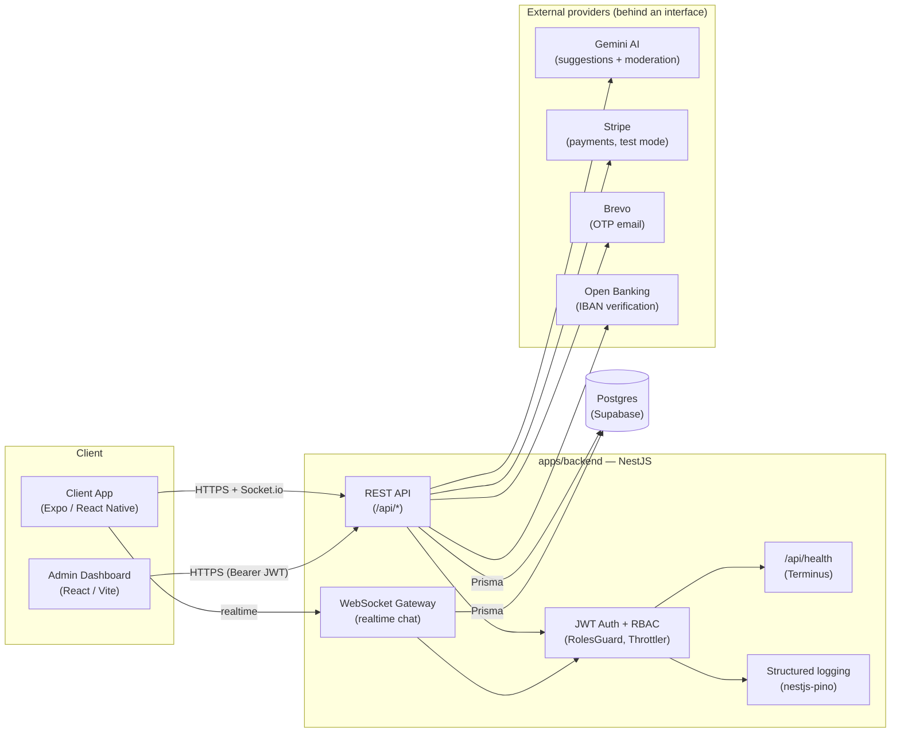

# Artisan Marketplace — Client App (GCC)

Marketplace connecting clients and artisans across Gulf countries (SA, AE, QA, KW).
Monorepo: Expo/React Native mobile app + React/Vite admin dashboard + NestJS/Prisma backend (Postgres on Supabase, deployed on Railway) + shared package.

## Architecture



Deploy: backend on Railway (Docker or direct Node build), Postgres on Supabase,
mobile distributed via Expo/EAS, admin dashboard as a static SPA (Vite build).

## Structure

- `apps/mobile` — Full client app (Expo, TypeScript). Also has a mock layer (`src/services/mockData.ts`) to work offline, but talks to the real backend by default (`src/services/config.ts`).
- `apps/admin` — Web dashboard (React + Vite + TS) for operators: login with `ADMIN` role check, dispute management (`/admin/disputes`), same API as the main backend.
- `apps/backend` — NestJS + Prisma, isolated modules with swappable provider interfaces (Stripe for payments, Gemini for AI, Lean for open banking).
- `packages/shared` — Shared types, constants (countries, cities, categories), validations.

## Quick start (mobile app)

```bash
cd apps/mobile
npm install
npx expo start
```

Open with Expo Go (iOS/Android) or a simulator.

## Backend

```bash
cd apps/backend
npm install
cp .env.example .env   # fill in DATABASE_URL/DIRECT_URL (Supabase), JWT_SECRET, etc.
npx prisma generate
npx prisma db push     # syncs the schema (no migrations folder: db push is used)
npm run start:dev
```

To create the admin account (no public endpoint does this):

```bash
# set ADMIN_EMAIL / ADMIN_PASSWORD in apps/backend/.env, then:
npm run prisma:seed-admin --workspace apps/backend
```

### Backend with Docker (one-command local setup)

Alternative to running Node locally: Postgres + backend containerized, no
Supabase credentials required (uses a disposable local database).

```bash
docker-compose up --build
```

The API responds on `http://localhost:3000/api`. On first boot it syncs the
Prisma schema to the local Postgres automatically.

### Health check & logging

- `GET /api/health` — used by Docker/Railway to check the service is alive:
  also verifies real database connectivity (`@nestjs/terminus`), not just that
  the process responds. Excluded from request logs to avoid noise.
- Structured logging via `nestjs-pino`: JSON in production (ready for a log
  aggregator), readable formatting (`pino-pretty`) in development. Sensitive
  headers (`Authorization`, `Cookie`) are always redacted from logs.

## Admin dashboard

```bash
cd apps/admin
npm install
cp .env.example .env   # point VITE_API_URL at the backend (Railway or localhost)
npm run dev
```

Login requires a user with the `ADMIN` role (see seed above). Sidebar layout
with sections: **Overview** (KPIs: users, artisans, requests by status,
revenue, open disputes), **Users**, **Artisans**, **Requests** (filter by
status, full detail view with quotes/contract/payment/dispute/review/event
timeline), **Payments**, **Reviews**, **Disputes** (resolve in favor of
client/artisan with two-step confirmation). Every section is protected by the
same RBAC (`@Roles('ADMIN')`) as the backend.

## Automated tests

```bash
cd apps/backend
npm test          # 26 unit tests (state machine, chat moderation, AI fallback)
npm run test:e2e  # 6 e2e tests on the auth flow (in-memory fake Prisma, no real DB involved)
```

CI pipeline (GitHub Actions) runs the build + both suites on every push/PR to `main`.

## Modules added for the portfolio

A focused subset of features, chosen to be defensible in depth during a
technical interview rather than covering the full scope of a startup.

**1. AI layer (Gemini, free tier)** — two concrete uses in the flow, not a
generic chatbot: on the client side it detects missing information in a
request's description (`POST /ai/analyze-text`); on the professional side it
suggests what to include in a quote (`POST /ai/suggest-quote`). A product rule
enforced *at the code level* (not just in the prompt): the returned
`disclaimer` is always a server-side constant, never model-generated text —
the AI never states a price as final. Provider sits behind an interface
(`AiProvider`, see `modules/ai/`) with automatic fallback to the mock provider
if `GEMINI_API_KEY` is missing or the call fails: an AI suggestion must never
break the flow.

**2. Chat with basic moderation** — regex (not NLP) to detect phone numbers,
emails, WhatsApp/Telegram/Instagram links and generic URLs in messages
(`common/contact-detector.ts`), blocked until the quote is accepted
(`ARTISAN_SELECTED` onward). Deliberate choice: for an MVP, regex is more
predictable and verifiable than an NLP classifier.

**3. Job Archive** — `Request` is the central entity (relations to Chat,
Quote, Payment, RequestEvent/Status History). All state transitions go
through an explicit state machine (`common/job-state-machine.ts`): no
arbitrary jump is possible on the backend side, regardless of what the client
sends.

**4. Basic security** — JWT + email OTP (bcrypt, sha256-hashed codes, 10-minute
TTL) were already in place; added: RBAC with `RolesGuard`/`@Roles()`, rate
limiting (5 attempts/min) on login and OTP verification (`@nestjs/throttler`),
Admin module (`/admin/disputes` and more) as the first endpoints genuinely
protected by role. **Scope note**: the `Role` enum only covers `CLIENT` and
`ADMIN` — there is no artisan app/authentication yet, so the `ARTISAN` role
wasn't added at this stage (future roadmap). "Artisan-side" endpoints (sending
a quote, AI suggestion) remain open as they already were, pending that app.
IDOR protection (a client can't read/modify another client's resources) was
already present everywhere via the `own()` pattern in each service, and
remains the standard for any new endpoint.

**5. EN/AR translation** — unlike the interface i18n (already present,
`src/i18n`), this translates **user-generated content** (chat messages,
request descriptions) on user request ("🌐 Translate" → "View original"),
with DB-side caching keyed on (text hash, target language): the same
translation never calls the AI twice. The original text is never overwritten.

### Future roadmap (out of scope here, by choice)

Professional app/authentication (`ARTISAN` role), reliability score, regulated
escrow, advanced AI modules (photo analysis via a vision model), monetization.

## Languages & RTL

i18n with English and Arabic. Switching language in Profile → Language applies
RTL (requires an app restart for full mirroring, standard React Native
behavior).

## Notes

- Payments (Stripe, test mode) and bank verification (Open Banking) sit behind
  swappable interfaces (see `// REAL PROVIDER:` comments in the code).
- Artisan quotes arrive automatically (simulated) ~10–25s after a request is
  submitted, so the entire end-to-end flow can be tested without an artisan
  app.
